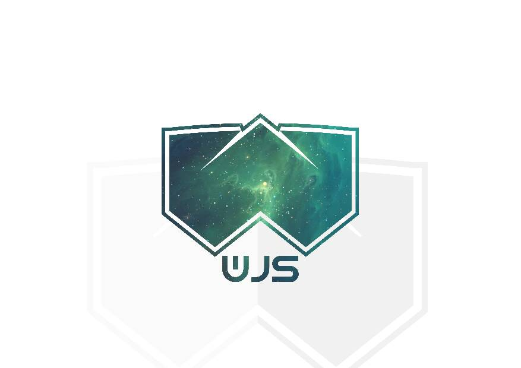

# wjs-cli:



## CLI for making web and android apps with HTML , CSS and JS (ES7)

# Under development.

## Getting started

* First get node and npm

* Run `npm install wjs-cli -g`

* Run `wjs -v` to confirm installation


* Run `wjs init <app-name> <app-type>` where app type can be any of `--typescript` ,`--vue` ,  `--javascript`, `--react`  or leave app type out to initialize a javascript project


* Run `cd <app-name> && wjs development` to start the development server


* Open http://localhost:3100 in your browser to view the app

* To add a dependency run `wjs add <module>` where the module can be a default module or a third party module
Check out [how to make a module](docs/create-modules.md)

* Use `wjs install <package-name>` to install a package, which is either a module or task runner 

* To create an app with an android project in its directory use `wjs init <app-name> <app-type> --local` which makes a native project directory in your app folder, and to allow editing the android source code use `wjs init <app-name> <app-type> --local --package=<app-package-name>` which generates the default wjs android source

* Use `wjs tasks` to see installed task runners


* Use `wjs run <task-alias>` to run the task

* To build the app run `wjs build` and use `wjs build --android` to build the android app, but first make sure `ANDROID_HOME` is set.


For a typescript project first `npm init` the project directory then install `ts-loader` and `typescript` with `npm install typescript ts-loader`.

For a vue project just `npm install` the project directory. 

To check for updates run `wjs check-update` and install any updates with `wjs update`


### Note

Vue projects dont have modules yet.

### Javascript

The default wjs hello world app entry point looks like this.

```javascript
import * as app from "../webjs_modules/app";

class App {
    constructor (root){
        root.innerHTML = "<h1>Hello World</h1>";
    }

    onViewLoad(){
        console.log("Done")
    }
}

app.load(document.getElementById("js-main"),App);
```

Obviously all it does is set "main" as the root innerHTML

But you can also do more, like add html templates by extending the class with the `TemplatePage` class in the app module

```javascript
//Declare imports here.
import * as app from "../webjs_modules/app"

class Application extends app.TemplatePage{
    constructor(){
        //Call the super class
        super();

        this.template = //HTML code in a string, most preferably use backticks to fully express the html
    }
    
    //Template load is used for template pages because the TemplateApplication class comes with its own onViewLoad
    onTemplateLoad(){
        //Code to run after the html renders
    }
}

app.load(document.getElementById("js-main"),App);
```

A page controller looks something like this

```javascript
//Imports can be made here just like any other module
export class PageName{
    /*
        Notice the class was exported beacause it needs to be imported in the app entry point.
    */
    constructor(){
        //Code to run before the page loads
    }

    onViewLoad(){
        //Code to run after the page loads
    }
}
```

A page controller can also be a page if you use `app.load(PAGE_NAME);`

Using pages as modules is as easy as adding the new keyword to invoke the class e.g

```javascript
//Declare imports here.
import * as app from "../webjs_modules/app"
import { PageName } from "path/to/PageName";

class Application {
    constructor(){
        //Code to run before the app loads
        var page = new PageName();
    }
    
    //Your apps entry point
    onViewLoad(){
        page.onViewLoad()
    }
}

app.load(document.getElementById("js-main"),App);
```

### Typescript

A typescript app is not much different from a javascript app.

### Vue

For vue apps just go ahead and read the docs at [the vue js site](https://vuejs.org/v2/guide/)

```javascript
import Vue from 'vue';
import App from "./App.vue"


/* eslint-disable no-new */
new Vue({
  el: '#app',
  render: h => h(App),
  template: "<App/>"
});
```

But vue specific modules are not ready yet so follow the vue docs only.

## Modules

### app

the app module has features like

* jsx function

* load function

* events

* socket

* streams

* TemplatePage

### streams, sockets and events

```javascript
//Declare imports here.
import * as app from "../webjs_modules/app"

class Application{
    constructor(){
        /*
            Socket demo
        */
        var socket = app.socket();
        this._socket = socket.connect("echo.websocket.org")
    }
    
    //Your apps entry point
    onViewLoad(){
        //Send message
        this._socket.on("connection",()=>{
            this._socket.send("Echo this back");
        })
        //Load emit function and on listener to the element
        app.events.bind(document);
        //Listen for the event
        document.on("printed-message",()=>{
            alert("Finished")
        })
        this._socket.on("message",(data)=>{
            //Use the data, but in this case i will stream each letter to the print function

            //Split the message into its characters and add html line endings
            var datas = data.split("").join("<br>").split("");
            //Emit the event and print the characters
            document.emit("printed-message");
            app.stream(datas).pipe(document.write)
        })

        //And you can remove event the element listeners by using app.events.strip(<element>);
    }
}

app.load(document.getElementById("js-main"),App);
```

#### load and JSX functions

```javascript
//Declare imports here.
import * as app from "../webjs_modules/app"

class Application{
    constructor(){
        //Code to run before the page loads
    }
    
    //Your apps entry point
    onViewLoad(){
        //JSX function accepts a funtion that returns a html string which the jsx function uses to create the html elements
        var div = app.JSX(()=>{
            //Stringify the document object
            var document_to_json = JSON.stringify(document,undefined,"\t");

            return `
            <pre>${document_to_json}</pre>
            `
        })

        document.body.appendChild(div);
    }
}
//Load function that bootstraps the applications
app.load(document.getElementById("js-main"),App);
```

#### TemplatePages

```javascript
//Declare imports here.
import * as app from "../webjs_modules/app"

class Application extends app.TemplatePage {
    constructor(){
        //Call the super class
        super();

        this.template = //HTML code in a string, most preferably use backticks to fully express the html
    }
    
    //Template load is used for template pages because the TemplateApplication class comes with its own onViewLoad
    onTemplateLoad(){
        //Code to run after the html renders
    }
}

app.load(document.getElementById("js-main"),App);
```

### material

the material module has many features like

* createElementClass

* setElementClass

* colors

* icons

#### createElementClass and setElementClass

This gives you the ability to add css classes in javascript!!! ikr

```javascript
//Declare imports here.
import * as app from "../webjs_modules/app"
import * as material from "../webjs_modules/material"

class Application{
    constructor(){
        /*
            Create class with the following syntax

            material.createElementClass(<class-name>,{
                "<property-name>": "<property-value>"
            })

            Set class with the following syntax

            material.setElementClass(<element>,<class-name>)
        */

        material.createElementClass("title",{
            "font-size":"50px"
        })
    }
    
    //Your apps entry point
    onViewLoad(){
        var paragraph = document.createElement("p");

        material.setElementClass(paragraph,"title")

        document.body.appendChild(paragraph)
    }
}

app.load(document.getElementById("js-main"),App);
```

#### icons and colors

All material standard colors and icons are present and ready to use

```javascript
//Declare imports here.
import * as app from "../webjs_modules/app"
import * as material from "../webjs_modules/material"

class Application{
    constructor(){
        /*
            Create an icon
            The string argument is the name of the icon as if it were defined in html

            var face = material.icons("face");

            Set color

            face.style.color = material.colors.blue;
        */
    }
    
    //Your apps entry point
    onViewLoad(){
        //Create an icon

        var face = material.icons("face");

        //Set color

        face.style.color = material.colors.blue;

        document.body.appendChild(face)
    }
}

app.load(document.getElementById("js-main"),App);
```
#### Android

First of all you need to make android project definitions in your `wjs-config.json` like this

```json
{
    /*Default config options*/
    "android": {
        "icons": {
            "normal": "relative/path/to/image/png",
            "circular": "relative/path/to/image/png"
        },
        "package": "<package-name>"/*e.g com.mypackage.org*/,
        "app_name": "<app-name>",
        "color": {
            "primary": "<hex-color>",
            "primaryDark": "<hex-color>",
            "accent": "<hex-color>"
        }
    }
}
```

Android functions are available as `native` and that syntax is planned to be maintained in the future on other operating systems.

``` javascript
//Declare imports here.
import * as wjs from "core"
import * as app from "wjs/app"

class Application{
    constructor(){
        
    }
    
    //Your apps entry point
    onViewLoad(){
        /**
         * NOTE: native does not work on the web because of obvious reasons like the browser not running Android OS
         **/


        //Toast

        native.toast("Hello android!");

        //Call activity

        native.call("555-XXX");

        //Sms activity

        native.sms("555-XXX","Hello");

        //Exit app

        native.exit();
    }
}

app.load(document.getElementById("js-main"),App);
```

### TODO (More docs)

## Changelog

#### wjs-cli@0.0.1

* Published wjs-cli on npm

#### wjs-cli@0.0.2 

* Added install feature to allow installation of any third party module

#### wjs-cli@0.0.3

* Created wjs-config.json file to allow specification of compile procedure and dependencies 

* Added `add` command to define project dependencies

* Changed bootstrap procedure to load `Application.onViewLoad` instead of `Application.main`

* Conducted unit tests for:
    1. Config file
    2. Compile procedure
    3. module installation
    4. Typescript application support

* Made basic typescript modules namely  `app.ts` , `web.ts (core)`, `http.ts` , `definitions.ts` , `material.ts`
#### wjs-cli@0.0.4

* Bug fixes

* Fixed errors in docs

* Vue support

#### wjs-cli@0.0.5

* More bug fixes

### wjs-cli@0.0.6

* Added android build

### wjs-cli@0.0.7

* Critical bug fix

### wjs-cli@0.0.8

* Critical bug fix

### wjs-cli@0.0.9

* Fix typos

### wjs-cli@0.1.0

* Bug fix

### wjs-cli@0.1.1

* Bug fix

### wjs-cli@0.1.2

* Added update feature

* Bug fix

### wjs-cli@0.1.3

* Support for Android ^5.0.0

* Added module publishinng

* Added [documentation for making modules](docs/create-modules.md)

### wjs-cli@0.1.4

* Fixed change-log error in readme

* Added task runner features

* Modularized source code

* Added option to initialize a local (Personal) project option

* Added contributing.md

### wjs-cli@0.1.5

* Bug fixes

### wjs-cli@1.0.0

* Bug fixes

### Coming soon

* More android features.

Use `wjs check-update` to check for version updates and bug fixes

Feel free to open an issue at [the github repo](https://github.com/neutrino2211/webjs/issues)